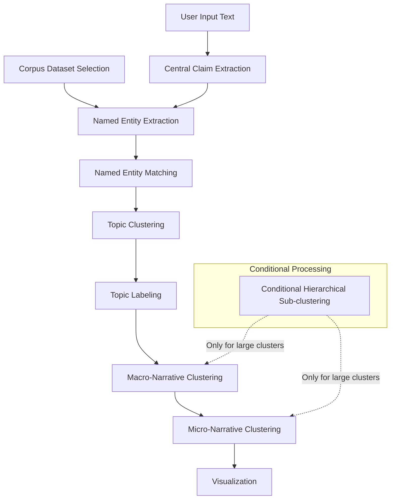

# Narrative Detection Pipeline Implementation Plan

Based on our discussion and the provided diagram, I'll now create a detailed plan for implementing the narrative detection pipeline. The pipeline will process both user-provided text and corpus datasets to detect narratives, extract claims, identify entities, and visualize the results.

## 1. Overall Architecture



## 2. Component Breakdown

### 2.1. Input Processing
- **User Text Input**: Process text provided by the user via the Streamlit UI
- **Corpus Dataset Selection**: Allow user to select corpus dataset (MultiClaim or Media Content Library) from the Streamlit UI dropdown (already implemented in demo.py)
- **Entity Matching Option**: Add UI control to enable/disable entity matching
- **Resource Management**: Add option to load models only when needed and unload after use to save computational resources

### 2.2. Central Claim Extraction
- First detect language of the input text using langdetect library
- Initialize wtpsplit with the detected language and extract sentences from the text
- Apply MDeBertaModel from mdeberta.py to classify each sentence as check-worthy or not
- **Highlight check-worthy sentences** in the Streamlit UI text area

### 2.3. Named Entity Extraction
- Use GLiNER model (already implemented in corpus.py)
- Extract entities from both corpus data and user-provided text
- **Preprocess corpus datasets only once** and save the results to local files
- Load preprocessed entity data on application startup if it exists

### 2.4. Named Entity Matching
- Implement entity matching among entities only (not between user text and corpus data)
- For each entity, search it on Wikipedia
- If the entity has a Wikipedia page, make it the entity prototype
- Replace all matching entities with this prototype (e.g., "Trump's" with "Donald Trump")
- Use Levenshtein distance (already available in corpus.py) for fuzzy matching
- **Make this step optional and selectable in the Streamlit UI**

### 2.5. Topic Clustering
- Enable **incremental clustering** using BERTopic, Louvain, and HDBScan with batch updates
- Build the topic hierarchy incrementally
- Maintain consistency across batches
- Allow for updating embeddings and clusters with new data
- Take into account the named entities as more general information about the context
- Use entity information to create more generalized topics (macro-clusters)
- Compute embeddings for BERTopic and HDBScan separately:
  - BERTopic embeddings rely on named entities
  - HDBScan embeddings rely on claim texts

### 2.6. Topic Labeling
- Generate topic labels by **summarizing the unique named entities** from all samples in each macro-cluster
- Use Ollama LLM to create descriptive labels that capture the essence of each topic

### 2.7. Narrative Clustering
- Apply **fine-grained clustering only for clusters with high population (over 50)**
- Implement an iterative process of splitting clusters into sub-clusters (micro-clusters)
- Continue splitting as long as newly formed clusters have a population larger than 5
- Use hierarchical clustering approach to maintain relationships between clusters
- This is the implementation of the Conditional Hierarchical Sub-clustering shown in the diagram

### 2.8. Visualization
- Use the existing visualization.py with DataMapPlot for interactive visualization
- Generate 2D embeddings for visualization using dimensionality reduction techniques
- Update the Streamlit UI to display the visualization

## 3. Implementation Details

### 3.1. pipeline.py Structure

```python
# Main components and their dependencies
class NarrativeDetectionPipeline:
    def __init__(self, config=None):
        # Initialize components (will be loaded on demand if resource saving is enabled)
        self.claim_extractor = None  # MDeBertaModel
        self.entity_extractor = None  # GLiNER
        self.topic_clusterer = None  # BERTopic
        self.macro_clusterer = None  # Louvain
        self.micro_clusterer = None  # HDBSCAN
        self.llm_client = None  # Ollama API client
        
        # Resource management flag
        self.save_resources = False
        
        # Load configuration
        self.config = config or self._default_config()
        
        # Initialize components based on config (if not saving resources)
        self._initialize_components()
    
    def _initialize_components(self):
        # Initialize all pipeline components
        # If save_resources is True, components will be loaded on demand
        pass
        
    def _load_component(self, component_name):
        # Load a specific component when needed
        # Unload other components if save_resources is True
        pass
    
    def _default_config(self):
        # Default configuration for the pipeline
        return {...}
    
    def process_user_text(self, text):
        # Process user-provided text
        # Return highlighted check-worthy sentences
        pass
    
    def load_corpus(self, corpus_name):
        # Load preprocessed corpus dataset
        # Check if preprocessed files exist, if not preprocess and save
        pass
    
    def run_pipeline(self, user_text=None, corpus_name=None, enable_entity_matching=True, save_resources=False):
        # Run the complete pipeline with optional entity matching
        # If save_resources is True, load and unload components as needed
        pass
    
    # Component-specific methods
    def detect_language(self, text):
        # Detect the language of the input text
        pass
        
    def split_sentences(self, text, language):
        # Split text into sentences using wtpsplit with the detected language
        pass
        
    def extract_claims(self, sentences):
        # Classify each sentence as check-worthy or not
        # Return sentences with classification results for highlighting
        pass
    
    def extract_entities(self, text):
        # Extract entities from text
        pass
    
    def match_entities(self, entities):
        # Match entities with Wikipedia entries
        # Create entity prototypes and normalize entity references
        # Only run if enabled by user
        pass
    
    def compute_embeddings(self, data, entities, for_bertopic=True):
        # Compute embeddings separately for BERTopic and HDBScan
        # BERTopic embeddings rely on named entities
        # HDBScan embeddings rely on claim texts
        pass
        
    def cluster_topics(self, data, entities):
        # Cluster data into topics using incremental approach
        # Take into account both text and entity information
        # Use the appropriate embeddings based on the clustering algorithm
        pass
    
    def label_topics(self, topics, entities):
        # Generate labels for topics by summarizing unique entities
        # Use Ollama LLM to create descriptive labels
        pass
    
    def cluster_narratives(self, data, min_cluster_size=50, min_samples=5):
        # Apply fine-grained clustering only to large clusters (population > 50)
        # Iteratively split clusters until reaching minimum size (population > 5)
        # This implements the Conditional Hierarchical Sub-clustering
        pass
    
    def visualize(self, data):
        # Generate visualization using visualization.py
        pass
```

### 3.2. Required Dependencies

```
# Core dependencies
pandas
numpy
scikit-learn
tqdm

# Text processing
langdetect
wtpsplit
transformers
sentence-transformers

# Entity extraction
gliner (already used in corpus.py)

# Clustering
bertopic
hdbscan
python-louvain (for Louvain community detection)

# LLM integration
ollama

# Wikipedia API
wikipedia-api

# Visualization
datamapplot (already used in visualization.py)

# UI
streamlit (already used in demo.py)
```

### 3.3. Integration with Existing Code

1. **corpus.py Integration**:
   - Reuse the existing functions for loading and preprocessing corpus datasets
   - Reuse the GLiNER entity extraction functionality
   - Add caching mechanism to save preprocessed entity data

2. **mdeberta.py Integration**:
   - Use the MDeBertaModel for claim classification

3. **visualization.py Integration**:
   - Use the existing visualization functions for generating interactive visualizations
   - Ensure the pipeline outputs data in the format expected by the visualization functions

4. **demo.py Integration**:
   - Update the demo.py file to use our new pipeline for processing user input and corpus data
   - Add UI elements for enabling/disabling entity matching
   - Add UI option for resource management (loading/unloading models as needed)
   - Implement highlighting of check-worthy sentences in the text area

## 4. Implementation Plan

### Phase 1: Core Pipeline Structure
1. Create pipeline.py with the basic structure and component interfaces
2. Implement configuration management
3. Set up integration with existing code (corpus.py, mdeberta.py)

### Phase 2: Text Processing Components
1. Implement language detection using langdetect
2. Implement sentence splitting using wtpsplit with language-specific models
3. Integrate with MDeBertaModel for claim extraction on individual sentences
4. Implement highlighting of check-worthy sentences in the UI

### Phase 3: Entity Extraction and Caching
1. Integrate with GLiNER for entity extraction
2. Implement caching mechanism for preprocessed entity data
3. Implement Wikipedia-based entity normalization
4. Add UI controls for enabling/disabling entity matching

### Phase 4: Incremental Clustering
1. Implement separate embedding computation for BERTopic and HDBScan
2. Implement incremental topic clustering using BERTopic with entity-based embeddings
3. Implement macro-narrative clustering using Louvain
4. Implement micro-narrative clustering using HDBSCAN with claim text embeddings
5. Implement the iterative cluster splitting logic for large clusters

### Phase 5: Topic Labeling
1. Implement Ollama LLM integration for topic labeling
2. Implement topic labeling using entity summarization
3. Generate descriptive labels for each cluster using the LLM

### Phase 6: Integration and Visualization
1. Integrate with visualization.py for generating interactive visualizations
2. Update demo.py to display the visualizations
3. Implement resource management for loading/unloading models
4. Implement end-to-end pipeline execution

### Phase 7: Testing and Optimization
1. Test with sample user inputs
2. Test with different corpus datasets
3. Optimize performance and resource usage

## 5. Challenges and Considerations

1. **Performance**: Processing large corpus datasets could be resource-intensive. The caching of preprocessed entity data and the option to load/unload models as needed will help, but we should also consider other optimizations.

2. **Incremental Clustering**: Implementing incremental clustering that maintains consistency across batches will be challenging. We'll need to carefully design the clustering algorithms to handle updates efficiently. Computing separate embeddings for BERTopic and HDBScan adds complexity but improves clustering quality.

3. **Multilingual Support**: Ensure all components handle multiple languages correctly, especially for entity extraction and topic modeling.

4. **UI Integration**: Highlighting check-worthy sentences in the Streamlit UI might require custom HTML/CSS rendering.

5. **Error Handling**: Implement robust error handling throughout the pipeline to gracefully handle failures in any component, especially for external services like Wikipedia API and Ollama LLM.

6. **Configurability**: Make the pipeline configurable to allow users to adjust parameters for different use cases, including clustering thresholds, resource management options, and entity matching settings.

7. **Wikipedia Integration**: The entity matching with Wikipedia might be slow or unreliable depending on network conditions. Consider implementing caching for Wikipedia lookups and fallback mechanisms when the service is unavailable.

8. **Ollama LLM Integration**: Ensure proper prompt engineering for the Ollama LLM to generate high-quality topic labels. Consider implementing caching for LLM responses to improve performance.